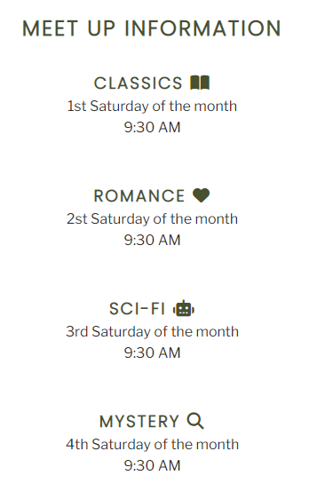
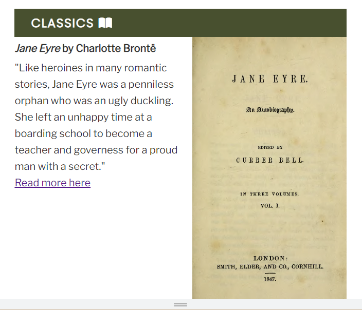
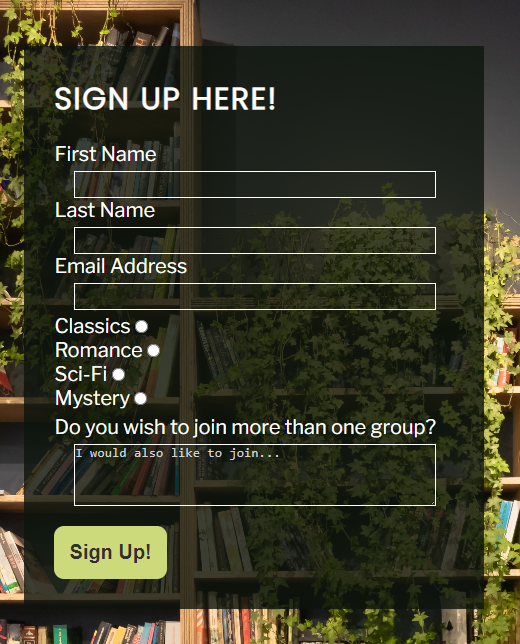
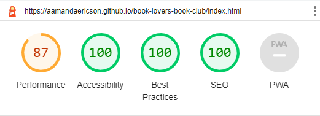
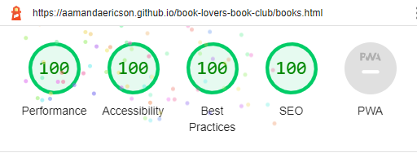
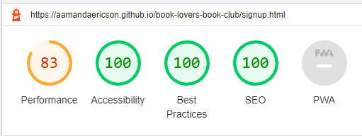

# Book Lovers
Book Lovers is a web page for people in the Stockholm region who are intrested in joining a book club.   
The book club has four different groups that all read different genres. 
 
 
On the Home page the user find information about the club and their approach to reading, as well as meet up times.  
From there they can use the menu in the header to eather read more about the books or sign up to the club.
 
 

 
 
## Features 
* ### Navigation
  * At the left top of the page, the logo BOOK LOVERS links to the top of the home page.
  * At the right top of the page (or if you are looking on a smaller device, beneath the logo) there are links to Home, Books and Sign Up. These will take you to different pages on the website. Screen shot of logo and menu links are below.
  * In the footer on the bottom of the page there are icons for different social media. These are links and will open the respective social media in a new tab. 
  * On the "Books page" there are internal links for each book that the groups are reading. The original idea of this was that it would be an easy way to navigate to the genre you are interested in. I thought about removing it due to the length of the page, that wasn't that long, but I descided to keep it for the posibility of adding more books in the future. For example, adding books that was previously read, making the page longer. Screen shot of the internal links is below.
  * On the book page there is also links at the bottom of each article that links to sites where you can read more about the books. 

  

  
 
 

* ### Hero image
    * For responsive design - the hero image is responsive and fit different screens. However I thought another image looked better on smaller screens so for screen sizes 500px and smaller there will be a different picture shown.  
      
  

   
* ### About Section
    * The about us section lets the user know of what approach the book club have to reading, that there are four different groups to choose from and that you will get more information about where the groups meet if they sign up. 

     

 * ### Meet up section
    * The Meet up section provides the user with information about the meet up times for each genre so that they can descide if it would fit their schedule.
    * The Meet up section also let user get acquainted to the icons from Font Awesome that are used consistantly for the genres.
     
     

    
     

* ### Books page
  * The books consists of four articles describing the books of each genre that is being read right now as well as having an image of the book, or an image that illustrates the genre. 
  * Each article has an icon for the genre which is the same ones used on the Meet up section
   
   

  

* ### Sign up page
  * The sign up page has a background image styled and applied with css and was chosen because of that the green of the plants and that the book shelf went good with the theme of the page.
  * The sign up form collects different kind of data from the user when provided. It collects a first name, a last name, an email address, what group the user is interested in joining and a textarea where the user can state if they want to join more than one group. 
     
     
    

## Testing
   * I tested that this page work with different browsers: Chrome, Firefox, Edge, Safari.
   * I confirmed that the site is responsive and looks good on different devices using devtools device toolbar.
   * I confirmed that the different pages on the site are all easy to understand and easy to read. 
   * I have confirmed that the form works, and all input entries except for the textarea element are required. One of the radio buttons must be pushed. The email field must contain an email address and the submit button works.

## Bugs
   * Had a problem of centering my content on the home page since I used a width of 90% and tried to use margins to center. However I realised that it was better to just use the full width and then to use text-align for both a simpler cleaner code and a better lay out.
   * When I first deployed my site on github pages some images didn't work because I used absolute file paths. Removing the staring */* fixed the problem.
   * When setting up my sign up form my first plan was to do check boxes for the part of "Which group do you want to join". I then realized that there wasn't a way of doing this using ONLY HTML and CSS. Therefore I used radio buttons and then an option of filling in the textarea providing information about joining multiple groups. 

## Validator testing
   * HTML
     * No errors were returned when passing through the official W3C validator.
   * CSS 
     * No errors were returned when passing through the official (Jigsaw) validator.
   * Accessibility 
     * I confirmed that the chosen fonts and colors are accessable using lighthouse.

     * Home page
      
     
      
     * Book page
      
     
      
     * Sign Up page
       
    

     

